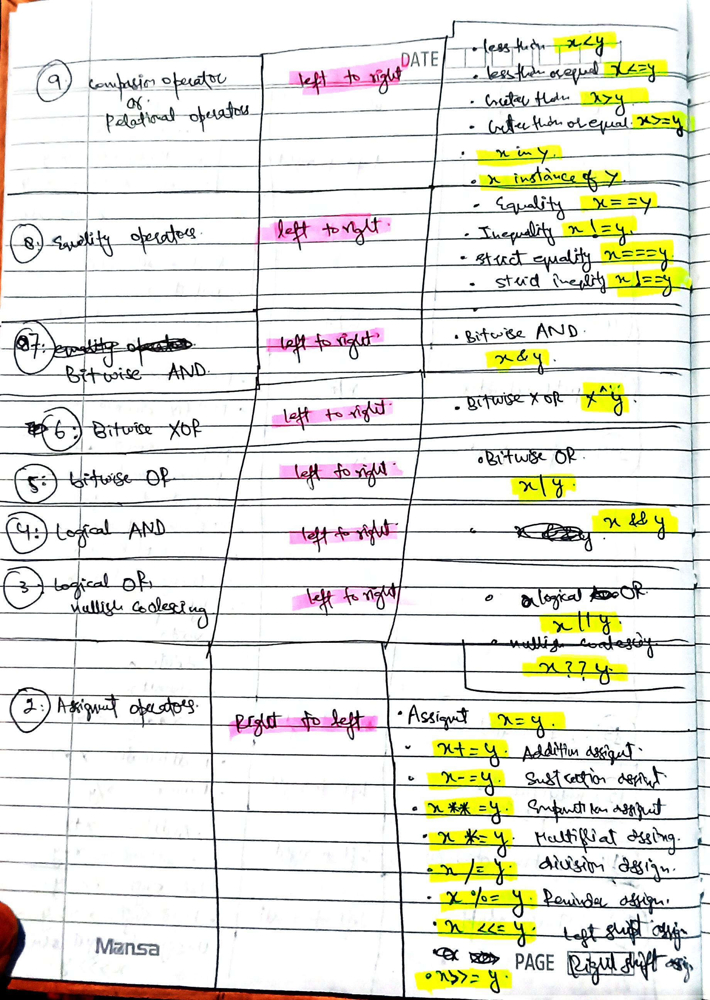

### it is format
 


### learning-javascript


### class9 - of - chapter1 - [Basic Operators]


### class10 - of - chapter1 - [Operator Precedense]





### class11 to 13 - of -  chapter1 - [challenge1]
*i do the challenge in my folder challenges.*


### class14 - of - chapter1 - [string and templeate litreals]


### class 15 [challenge2]
*complete the challenge in challenge folder*

### Class16 to 18 - of - chpater1 [taking decisions if else statements & type conversion and type coercion]


### Class19 - of - chapter1 - truthy and falsy statements


### Class20 - of - chapter1 - Equality Operators
 
 
 
 


### Class21 - of - chapter1 - Boolean Logic & Operators


### Class22 - of - chapter1 - Logical Operators
 


### Class - 23 & 24 - of - chapter1 - challenge3 completed
*completed in my challenges folder*


### Class25 - of - chapter1 - The Switch Statement
 


### Class26 - of - chapter1 - Statements and Expressions
**here we just learn the difference between expressiond and statements only thing to remember from that lecture in future classes we have to learn more about this**


### Class27 - of -chapter1 - The Conditional Operator

 


### Class 28 to 29 - of - chapter1 - challenge4
**i done this in my challenges folder**


### Class 30 - of - chapter1 - Javascript Releases
*only history of js*


**chapter1-complete-here

### Class 1 to 2 - of - chapter2 - Activating Strict Mode
- use strict mode in js file before writting any code eg.
``` 'use strict';```

### Class3 - of - chapter2 - Functions
 
 
 

[](https://youtube.com/shorts/6FXoRSh_YC8?si=HtvzaTMZpSGD6HAN)
[](https://youtu.be/y3i4Fca-_H4?si=GAZILy-WOmEczzo1)


### Class4 - of - chapter2 - Function Declaration vs Expressions
 
 


### Class5 - of - chapter2 - Arrow Functions

 
 

```
const clacAge3 = birthYear => 2073 - birthYear;
const age = clacAge3(2007);
console.log(age);


const mobileNameAndWarranty = (buyYear, timeUsed, naam) => {
    const warrantyTime = 2025 - buyYear;
    const warrantyLeft = warrantyTime - timeUsed;
    return `${naam} warranty left only ${warrantyLeft}`;
}
const hi3 = mobileNameAndWarranty(2023, 1, "poco");
console.log(hi3)
```
**look here i write many parameters and also many lines of code here**


### Class6 - of - chapter2 - Functions Calling Other Functions
 
- or another example is 
```
var warrantyMonths = function (inMonths) {
    return inMonths * 12;
}

const mobileNameAndWarranty2 = (buyYear1, timeUsedInYears1, naam1) => {
    const warrantyTime1 = 2025 - buyYear1;
    const warrantyLeft1 = warrantyTime1 - timeUsedInYears1;

    var howMonths = warrantyMonths(warrantyLeft1)


    return `${naam1} warranty left only ${howMonths} months`;
}
const hi32 = mobileNameAndWarranty2(2023, 1.5, "poco m4 pro 5G");
console.log(hi32)
```
## look how calling function from another function works
 

### Class7 - of - chapter2 - Function Reviewing
 
 - another example is her bro...
```
var warrantyMonths3 = function (inMonths) {
    return inMonths * 12;
}


const mobileNameAndWarranty3 = (buyYear3, timeUsedInYears3, naam3) => {


    const warrantyTime3 = 2025 - buyYear3;
    const warrantyLeft3 = warrantyTime3 - timeUsedInYears3;

    var howMonths3 = warrantyMonths3(warrantyLeft3)
    if (howMonths3 > 0) {
        return `${naam3} warranty left only ${howMonths3} months`;
    }
    else if (buyYear3 !== typeof number && timeUsedInYears3 !== typeof number) {
        return `enter valid data only in maths`
    }
    else if (howMonths3 <= 0) {
        return `${naam3} warranty is already expired`;
    }
}
const hi321 = mobileNameAndWarranty3(prompt(`enter buying year`), prompt(`enter how many years u used it`), prompt(`enter name of ur device`));
console.log(hi321);
```


