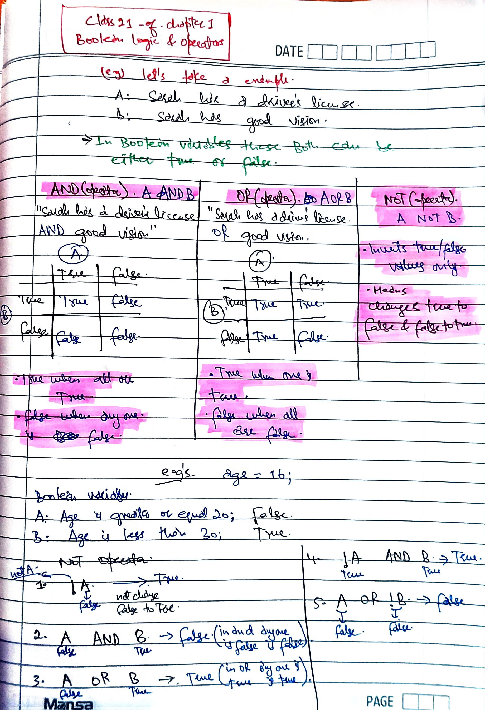
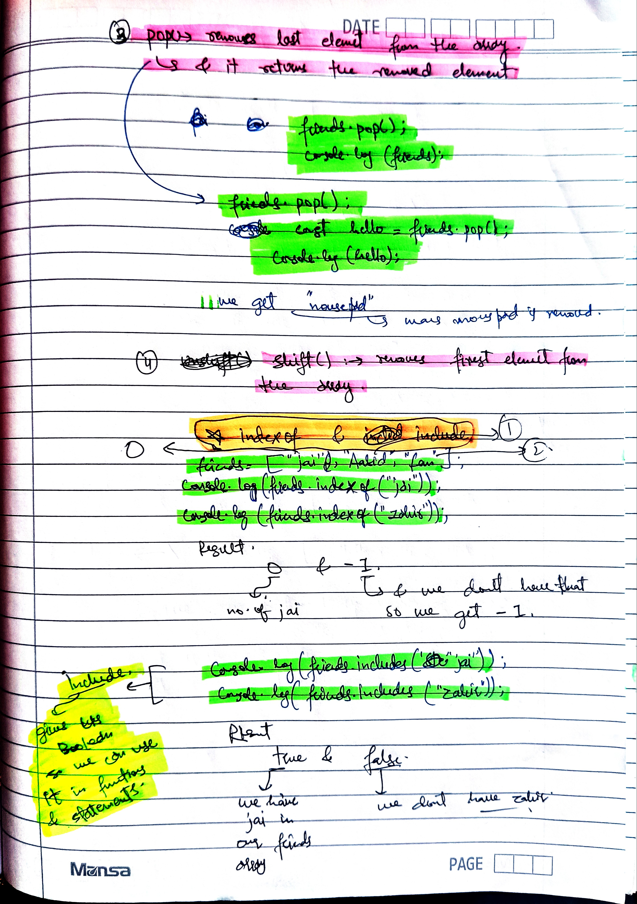

### it is format


### git format

git add .
git commit -m "complete class9 of chapter8"
git push

### learning-javascript


### class9 - of - chapter1 - [Basic Operators]


### class10 - of - chapter1 - [Operator Precedense]


### class11 to 13 - of - chapter1 - [challenge1]

_i do the challenge in my folder challenges._

### class14 - of - chapter1 - [string and templeate litreals]


### class 15 [challenge2]

_complete the challenge in challenge folder_

### Class16 to 18 - of - chpater1 [taking decisions if else statements & type conversion and type coercion]


### Class19 - of - chapter1 - truthy and falsy statements


### Class20 - of - chapter1 - Equality Operators


### Class21 - of - chapter1 - Boolean Logic & Operators



### Class22 - of - chapter1 - Logical Operators


### Class - 23 & 24 - of - chapter1 - challenge3 completed

_completed in my challenges folder_

### Class25 - of - chapter1 - The Switch Statement


### Class26 - of - chapter1 - Statements and Expressions

**here we just learn the difference between expressiond and statements only thing to remember from that lecture in future classes we have to learn more about this**

### Class27 - of -chapter1 - The Conditional Operator


### Class 28 to 29 - of - chapter1 - challenge4

**i done this in my challenges folder**

### Class 30 - of - chapter1 - Javascript Releases

_only history of js_

\*\*chapter1-complete-here

### Class 1 to 2 - of - chapter2 - Activating Strict Mode

- use strict mode in js file before writting any code eg.
  ` 'use strict';`

### Class3 - of - chapter2 - Functions


[](https://youtube.com/shorts/6FXoRSh_YC8?si=HtvzaTMZpSGD6HAN)
[](https://youtu.be/y3i4Fca-_H4?si=GAZILy-WOmEczzo1)


### Class4 - of - chapter2 - Function Declaration vs Expressions


### Class5 - of - chapter2 - Arrow Functions


```
const clacAge3 = birthYear => 2073 - birthYear;
const age = clacAge3(2007);
console.log(age);


const mobileNameAndWarranty = (buyYear, timeUsed, naam) => {
    const warrantyTime = 2025 - buyYear;
    const warrantyLeft = warrantyTime - timeUsed;
    return `${naam} warranty left only ${warrantyLeft}`;
}
const hi3 = mobileNameAndWarranty(2023, 1, "poco");
console.log(hi3)
```

**look here i write many parameters and also many lines of code here**

### Class6 - of - chapter2 - Functions Calling Other Functions


- or another example is

```
var warrantyMonths = function (inMonths) {
    return inMonths * 12;
}

const mobileNameAndWarranty2 = (buyYear1, timeUsedInYears1, naam1) => {
    const warrantyTime1 = 2025 - buyYear1;
    const warrantyLeft1 = warrantyTime1 - timeUsedInYears1;

    var howMonths = warrantyMonths(warrantyLeft1)


    return `${naam1} warranty left only ${howMonths} months`;
}
const hi32 = mobileNameAndWarranty2(2023, 1.5, "poco m4 pro 5G");
console.log(hi32)
```

## look how calling function from another function works


### Class7 - of - chapter2 - Function Reviewing


- another example is here bro...

```
var warrantyMonths3 = function (inMonths) {
    return inMonths * 12;
}


const mobileNameAndWarranty3 = (buyYear3, timeUsedInYears3, naam3) => {


    const warrantyTime3 = 2025 - buyYear3;
    const warrantyLeft3 = warrantyTime3 - timeUsedInYears3;

    var howMonths3 = warrantyMonths3(warrantyLeft3)
    if (howMonths3 > 0) {
        return `${naam3} warranty left only ${howMonths3} months`;
    }
    else if (buyYear3 !== typeof number && timeUsedInYears3 !== typeof number) {
        return `enter valid data only in maths`
    }
    else if (howMonths3 <= 0) {
        return `${naam3} warranty is already expired`;
    }
}
const hi321 = mobileNameAndWarranty3(prompt(`enter buying year`), prompt(`enter how many years u used it`), prompt(`enter name of ur device`));
console.log(hi321);
```

### Class 8 to 9 - of - chapter2 - Challenge5

_i have done it this challenge in my challenge folder_

### Class10 - of chapter2 - introduction to Array


### Class11 - of - chapter2 - Basic Array Operations




### class12 & 13 - of - chapter2 - Is a Challenge

_done in my challenges folder in challenge6_

### Class14 - of - Chapter2 - Introduction to Objects

 +

### Class15 - of - chapter2 - Dot vs Bracket Notation


**result**


### Class16 - of - Chapter2 - Object Methods


### Class 17 to 18 - of - chapter2 - challenge7

**already done in my challenge folder**

### Class19 - of - chapter2 - Iteration Of For Loop


### Class20 - of - chapter2 - Looping Arrays, Breaking and Continuing


### Class21 - of - chapter2 - LoopingBackwards And Loops In Loops


### Class22 - of - chapter2 - While loop


#### Chapter3 starts

**chapter3 is just the roadmap of this jscourse**

#### Chapter4 starts

**i think this chapter is just about settings of vs code**

### class1-2 - of - chapter4

_are just intros of chapter 4_

### Class3 - of - chapter4 - setting up prettier extension

_also nothing in this video just tells how to set up prettier extension_

### Class4 - of - chapter4 - Installing Node.js and Setting Up a Dev Environment

**in this telling is how to install live server**
_and nothing important_

### Class5 - of - chapter4 - Learning How to Code

**just motivation in this class Class5 to whole chapter- of - chapter4 - Learning How to Code. Just motivation in this chapter, settings, debugging, ai assistance in coding**

### Chapter5

**is just about html and css for those who dont know about html and css but we already know**

### chapter6

### class 1 to 11 - projec1(Guess My Number)

_projec1 html code_

```
<!DOCTYPE html>
<html lang="en">
  <head>
    <meta charset="UTF-8" />
    <meta name="viewport" content="width=device-width, initial-scale=1.0" />
    <title>Document</title>
  </head>
  <body>
    <script src="project1.js"></script>
    <link rel="stylesheet" href="project1.css" />

      <body>
    <header>
      <h1>Guess My Number!</h1>
      <p class="between">(Between 1 and 20)</p>
      <button class="btn again">Again!</button>
      <div class="number">?</div>
    </header>
    <main>
      <section class="left">
        <input type="number" class="guess" />
        <button class="btn check">Check!</button>
      </section>
      <section class="right">
        <p class="message">Start guessing...</p>
        <p class="label-score">💯 Score: <span class="score">20</span></p>
        <p class="label-highscore">
          🥇 Highscore: <span class="highscore">0</span>
        </p>
      </section>
    </main>
  </body>
</html>

```

_project1 css code_

```
@import url("https://fonts.googleapis.com/css?family=Press+Start+2P&display=swap");

* {
  margin: 0;
  padding: 0;
  box-sizing: inherit;
}

html {
  font-size: 62.5%;
  box-sizing: border-box;
}

body {
  font-family: "Press Start 2P", sans-serif;
  color: #eee;
  background-color: #222;
  /* background-color: #60b347; */
}

/* LAYOUT */
header {
  position: relative;
  height: 35vh;
  border-bottom: 7px solid #eee;
}

main {
  height: 65vh;
  color: #eee;
  display: flex;
  align-items: center;
  justify-content: space-around;
}

.left {
  width: 52rem;
  display: flex;
  flex-direction: column;
  align-items: center;
}

.right {
  width: 52rem;
  font-size: 2rem;
}

/* ELEMENTS STYLE */
h1 {
  font-size: 4rem;
  text-align: center;
  position: absolute;
  width: 100%;
  top: 52%;
  left: 50%;
  transform: translate(-50%, -50%);
}

.number {
  background: #eee;
  color: #333;
  font-size: 6rem;
  width: 15rem;
  padding: 3rem 0rem;
  text-align: center;
  position: absolute;
  bottom: 0;
  left: 50%;
  transform: translate(-50%, 50%);
}

.between {
  font-size: 1.4rem;
  position: absolute;
  top: 2rem;
  right: 2rem;
}

.again {
  position: absolute;
  top: 2rem;
  left: 2rem;
}

.guess {
  background: none;
  border: 4px solid #eee;
  font-family: inherit;
  color: inherit;
  font-size: 5rem;
  padding: 2.5rem;
  width: 25rem;
  text-align: center;
  display: block;
  margin-bottom: 3rem;
}

.btn {
  border: none;
  background-color: #eee;
  color: #222;
  font-size: 2rem;
  font-family: inherit;
  padding: 2rem 3rem;
  cursor: pointer;
}

.btn:hover {
  background-color: #ccc;
}

.message {
  margin-bottom: 8rem;
  height: 3rem;
}

.label-score {
  margin-bottom: 2rem;
}

```

_now js_


### class 12 to 14 - projec2(Model Window)

**Html code**

```
<!DOCTYPE html>
<html lang="en">
  <head>
    <meta charset="UTF-8" />
    <meta name="viewport" content="width=device-width, initial-scale=1.0" />
    <title>Document</title>
    <link rel="preconnect" href="https://fonts.googleapis.com" />
    <link rel="preconnect" href="https://fonts.gstatic.com" crossorigin />
    <link
      href="https://fonts.googleapis.com/css2?family=Acme&family=Anek+Telugu:wght@100..800&family=Aoboshi+One&family=Are+You+Serious&family=Astloch:wght@400;700&family=Exo+2:ital,wght@0,100..900;1,100..900&family=Federant&family=Fira+Sans:ital,wght@0,100;0,200;0,300;0,400;0,500;0,600;0,700;0,800;0,900;1,100;1,200;1,300;1,400;1,500;1,600;1,700;1,800;1,900&family=Forum&family=Inconsolata:wght@200..900&family=Roboto:ital,wght@0,100..900;1,100..900&family=Rock+Salt&family=Shadows+Into+Light&family=WDXL+Lubrifont+TC&display=swap"
      rel="stylesheet"
    />
  </head>
  <body>
    <div class="show-case">
      <button class="show-model">Show Model 1</button>
      <button class="show-model">Show Model 2</button>
      <button class="show-model">Show model 3</button>
    </div>
    <div class="hidden">
      <div class="hidden-model-styles">
        <button class="cross-btn">&times;</button>
        <h1>Hey Hi I a'm a Model Window 🥰</h1>
        <p>
          Lorem, ipsum dolor sit amet consectetur adipisicing elit. In, pariatur
          voluptatibus? Ratione voluptate alias ullam possimus atque eius, nam
          eaque similique rem iure a eveniet velit reiciendis, impedit soluta
          vel. Eveniet iste expedita dolorem dolor aliquid incidunt non, fugiat
          quasi ipsam tempora tempore nihil. Asperiores ad explicabo iste
          mollitia laborum doloremque dolores, obcaecati adipisci ea sequi
          voluptatibus. Ex, quo consequatur. Quidem laborum rem, aperiam,
          officiis quae aliquam nam dignissimos incidunt magni voluptate velit
          in nostrum! Modi quis eveniet error, nisi, culpa quas cumque
          praesentium aperiam, ex esse architecto dolorem inventore.
        </p>
      </div>
    </div>
    <div class="overlay hidden"></div>
    <link rel="stylesheet" href="project2.css" />
    <script src="project2.js"></script>
  </body>
</html>

```

**css code**

```
body {
  color: white;
  background: linear-gradient(to right, #0054b4, #40e0d0);
  display: flex;
  flex-direction: column;
  align-items: center;
}
.show-case {
  display: flex;
  flex-direction: row;
  justify-content: space-around;
  width: 100%;
}
.show-model {
  border: none;
  text-decoration: none;
  font-size: 4rem;
  border-radius: 30%;
  padding: 8px 16px; /* 10px top/bottom, 5px left/right */
}
.hidden-model-styles {
  display: flex;
  flex-direction: column;
  background-color: #6617cb;
  background-image: linear-gradient(315deg, #6617cb 0%, #cb218e 74%);
  width: 600px;
  align-items: center;
  justify-content: center;
  margin-top: 50px;
  z-index: 2;
  position: fixed;
  top: 50%;
  left: 50%;
  transform: translate(-50%, -50%);
}
.hidden-model-styles p {
  font-size: 1.6rem;
  padding-left: 5px;
  font-family: Shadows Into Light;
  font-weight: bold;
}
.hidden {
  display: none;
}
.overlay {
  position: absolute;
  top: 0;
  left: 0;
  width: 100%;
  height: 100%;
  background: rgba(0, 0, 0, 0.4); /* dim effect */
  backdrop-filter: blur(5px); /* blur effect */
  z-index: 1;
}

```

**js-code**

```
"use strict;";
const openBtn = document.querySelectorAll(".show-model");
const hiddenDiv = document.querySelector(".hidden");
const overlay = document.querySelector(".overlay");
const addinghidden = function () {
  hiddenDiv.classList.add("hidden");
  overlay.classList.add("hidden");
};
const removeHidden = function () {
  hiddenDiv.classList.remove("hidden");
  overlay.classList.remove("hidden");
};

for (let i = 0; i < openBtn.length; i++) {
  openBtn[i].addEventListener("click", function () {
    removeHidden();
  });
}
const showNow = document.querySelector(".cross-btn");
showNow.addEventListener("click", function () {
  addinghidden();
});
document.addEventListener("keydown", function (hi) {
  if (hi.key === "Escape") {
    if (!hiddenDiv.classList.contains("hidden")) {
      addinghidden();
    }
  }
});

```


_IMPORTANT THINGS LEARNED IN THESE TWO PROJECTS_

Project 1: Guess the Number Game

New things / important points learned:

DOM Manipulation

document.querySelector() → select elements

.textContent → change text

.style → change CSS dynamically

Event Listeners

.addEventListener("click", function(){}) → run JS when a button is clicked

Functions for Reusability

Created helper functions like displaymessage(), displaynumber(), displayscore()

Keeps code clean and avoids repetition

Random Numbers

Math.random() + Math.trunc() → generate secret number

Learned how to set a range (1–30)

Conditional Logic

if, else if, else to handle:

no input

too high / too low

correct guess

game over

Dynamic Styling

Change body color based on win/loss

Change .number width dynamically

Score / Highscore Logic

Keep track of score

Compare score to highscore and update

Resetting the Game

Clicking “Again” button resets all variables and UI elements

Takeaway: Learned how to combine DOM manipulation, events, random numbers, conditional logic, and dynamic styling to create an interactive game.

Project 2: Modal Popup

New things / important points learned:

Multiple Element Selection

document.querySelectorAll() → select multiple buttons

Loop through them with for to add event listeners

Showing / Hiding Elements

.classList.add("hidden") and .classList.remove("hidden") → toggle visibility

Overlay / Focus Logic

Learned why overlay is needed for UX (blocks background, dim effect)

Both modal and overlay always toggle together

Event Handling for Different Actions

Click to open modal

Click × to close modal

Press Escape key to close modal

Clean Code Practices

Use functions (addinghidden / removeHidden) to avoid repeating code

Keeps code DRY (Don’t Repeat Yourself)

Z-Index and CSS Positioning

Learned how to position modal in center with position: fixed + transform: translate(-50%, -50%)

Use z-index to make modal appear above overlay

Takeaway: Learned how to create interactive UI components with show/hide logic, overlay, multiple event triggers, and clean JS + CSS structure.

✅ Suggestion for README format:

You can write it like this:

Project 1 – Guess the Number Game

Features: Random number, input check, score & highscore, dynamic styling

Key JS concepts learned: DOM manipulation, events, functions, conditional logic, random numbers

Project 2 – Modal Popup

Features: Multiple modals, overlay, close via button or Escape key

Key JS concepts learned: DOM selection, class toggle, multiple event listeners, z-index & CSS positioning

#### Chapter7

# 🧠 How JavaScript Works Behind the Scenes

### _(Lectures 1 – 4)_

---

## 1️⃣ Section Intro

### 🎯 Goal of This Section

- Understand what actually happens **inside the JavaScript engine** when code runs.
- Learn how **memory**, **call stack**, **scope**, **hoisting**, and the **`this` keyword** behave behind the curtain.
- Build a clear **mental model** so you can reason about problems instead of memorizing rules.

When you run a JavaScript file in a browser or Node.js:

1. the text of your code is first **read and parsed**,
2. then the **engine** converts it into **machine instructions**,
3. finally all instructions are **executed step‑by‑step** inside an organized system of memory (the heap) and tasks (the call stack).

**Analogy:** It’s like watching a movie.

- You’re the screenwriter (developer).
- The **projector** is the engine turning each frame into moving pictures.
- The **cinema theater** = the runtime environment (browser / Node) that provides lights, sound, and audience seating.

---

## 2️⃣ A High‑Level Overview of JavaScript

### 🧩 Definition

> JavaScript is a **high‑level**, **interpreted / JIT‑compiled**, **single‑threaded**, **garbage‑collected**, **multi‑paradigm**, **prototype‑based**, and **dynamic** programming language that runs inside an engine such as **V8 (Chrome / Node.js)**.

---

### 🔹 High‑Level Language

JavaScript is considered _high‑level_ because it hides complicated operations like memory allocation and CPU instruction management.  
You tell it _what_ to do, not _how_.  
This makes development faster but also means you depend on the engine’s internals for performance.

---

### 🔹 Interpreted + JIT‑Compiled

Older JS engines simply _interpreted_ line‑by‑line, but modern ones like V8 use **JIT (Just‑In‑Time)** compilation:

1. **Parsing** → JS code is read and turned into an **AST (Abstract Syntax Tree)**.
2. **Bytecode** → AST converted to lower‑level bytecode.
3. **JIT Compile** → frequently used functions compiled into machine code while the program runs.

So JS is _both_ interpreted and compiled for speed.

---

### 🔹 Single‑Threaded + Non‑Blocking

The JS engine itself runs on **one main thread**, executing one instruction at a time.  
However, due to the **event loop**, it never truly “waits”.  
Tasks that take time (timers, network requests) are handled by Web APIs, and their results are processed later.

```js
console.log("Start");

setTimeout(() => console.log("Async Task Done"), 1000);

console.log("End");
```

**Output**

```text
Start
End
Async Task Done
```

Even though the timer was 1 second, the engine didn’t stop; it continued and only printed “Async Task Done” when the callback came back from the Web API.  
This demonstrates JS’s **non‑blocking** asynchronous nature.

---

### 🔹 Garbage Collected

JavaScript performs **automatic memory management**.  
When a value is unreachable (no variable references it), the **garbage collector** reclaims that memory.  
It lets us focus on logic instead of manual memory cleanup.

---

### 🔹 Multi‑Paradigm and Dynamic

JS is flexible; it supports

- **procedural** (calling functions step by step),
- **object‑oriented** (using objects with methods and prototypes), and
- **functional** (using higher‑order functions).

It is also **dynamic**: variables can change type.

```js
let example = 42; // number
example = "forty‑two"; // now a string – JS allows this
```

---

## 3️⃣ The JavaScript Engine and Runtime

### 🧠 Definition

A **JavaScript Engine** is the heart of the language implementation.  
It reads the code you write, compiles it to low‑level machine instructions, and executes them extremely fast.

**Examples of Engines:**

- **V8** → used in Chrome and Node.js (C++)
- **SpiderMonkey** → used in Firefox (C / C++)
- **JavaScriptCore (Nitro)** → used in Safari (C)
- **Chakra** → used in older Microsoft Edge

Every engine has the same job but different optimizations.

**Why we need an engine:**  
Computers don’t understand text or keywords; they understand machine code.  
The engine = translator + executor turning JS into instructions that a CPU can follow.

---

### ⚙️ Main Parts of the Engine

Every JS engine has two main physical areas of memory:

- **Heap** → a huge “storage room” in memory where objects, arrays, and functions reside.
- **Call Stack** → a data structure that keeps track of which function is currently running (**LIFO – Last In First Out**).

These two work together to make execution possible.

---

### ✳️ Analogy

- The **Heap** is your *pantry* — a storage area for ingredients (objects).
- The **Call Stack** is your *to‑do list* — each function call is a task on top of it.  
  When you finish a task, you remove it (last in, first out).

```js
function wash() {
  console.log("Washing");
}
function cook() {
  console.log("Cooking");
}
function eat() {
  console.log("Eating");
}

wash();
cook();
eat();
```

**Stack Order**

```text
1. wash() → run → removed
2. cook() → run → removed
3. eat()  → run → removed
```

---

### 🌐 Runtime Environment

The **engine** alone only executes plain JavaScript.  
It doesn’t know about the DOM, network requests, or timers.  
Those are provided by the **Runtime Environment** (like Chrome or Node.js).

**A runtime includes:**

- **Web APIs** → DOM, Timers, Fetch, etc.
- **Callback Queue** → completed asynchronous callbacks waiting to run.
- **Microtask Queue** → resolved Promises.
- **Event Loop** → a manager that checks if the Call Stack is empty and moves queued tasks back into it.

```js
console.log("A");

setTimeout(() => console.log("C (from Callback Queue)"), 0);

Promise.resolve().then(() => console.log("B (from Microtask Queue)"));

console.log("D");
```

**Timeline of Execution**
1. `A` logged  → Call Stack.  
2. `setTimeout` → Web API async job.  
3. `Promise.resolve()` → Microtask Queue.  
4. `D` logged immediately.  
5. Event Loop sees stack empty → executes microtasks → prints `B`.  
6. Then callback → prints `C`.

**Final Output**

```text
A
D
B (from Microtask Queue)
C (from Callback Queue)
```

✅ Promises (run via Microtask Queue) always execute before regular callbacks (setTimeout, I/O).

---

## 4️⃣ Execution Contexts and the Call Stack

### 🧾 Definition

An **Execution Context (EC)** is the environment in which a piece of JavaScript code is evaluated and executed.  
It contains all the necessary information for that piece of code to run:  
- the *variables* it can access,  
- the *functions* it can call, and  
- the value of `this`.

Think of an EC as a temporary workspace for the engine whenever it needs to execute something.

---

### 🔸 Types of Execution Contexts

1. **Global Execution Context (GEC)**  
    - Created automatically when the script starts.  
    - Holds global variables and function declarations.  
    - Creates the *global object* (`window` in browsers, `global` in Node).  
    - `this` inside the global context points to that global object.

2. **Function Execution Context (FEC)**  
    - Created whenever a function is invoked.  
    - Each context has its own variable environment and `this`.

3. **Eval Context (rare)**  
    - Created when `eval()` is executed (bad practice and rarely used).

---

### 🪜 Lifecycle of an Execution Context

Each Execution Context goes through two main phases:

#### **1. Creation Phase**
- JavaScript engine allocates memory for variables and functions.  
- All functions are stored while variables are set to `undefined`.  
 (This is why *hoisting* exists.)  
- The scope chain is set up.  
- The value of `this` is decided.

#### **2. Execution Phase**

- Code executes line by line; values are assigned to variables and functions are actually called.

```js
function one() {
  console.log("Inside one");
  two();
}

function two() {
  console.log("Inside two");
}

one();
```

**Stack Trace Explanation**
1. JS creates the Global Execution Context (first frame).  
2. `one()` pushed onto the stack.  
3. While inside, `two()` is called → pushed on top.  
4. `two()` finishes → popped off.  
5. Control returns to `one()` → finishes → popped off.  
6. Stack empty → program done.

**Visualization**

```text
[Global]
 → one()
   → two()
   ← two done
 ← one done
[Global done]
```

---

### 🧩 Call Stack vs Scope Chain (Preview)

| Concept          | Controls What         | Meaning                                                  |
| :--------------- | :-------------------- | :------------------------------------------------------- |
| **Call Stack**   |  Order of Execution   |  Which function is currently running and what comes next |
| **Scope Chain**  |  Variable Visibility  |  Where each variable can be found while the code runs    |

> **Call Stack = Control Flow**  
> **Scope Chain = Data Lookup Flow**

They co‑operate constantly: each time a function runs, a new Execution Context enters the stack and a new scope begins.

---

✅ **Key Takeaways (so far)**  
- The engine executes JS code inside Execution Contexts.  
- The Call Stack organizes these contexts in a LIFO structure.  
- Each function call creates a new context.  
- The runtime provides extra asynchronous tools and communicates with the engine via the event loop.  
- Once a context finishes, it’s popped off, leaving the stack clean until the next task arrives.

# 🧠 How JavaScript Works Behind the Scenes

### _(Lectures 5 – 8)_

---

## 5️⃣ Execution Contexts and the Call Stack — In Practice

### 🧾 Definition

An **Execution Context (EC)** is a special container created by the JavaScript engine every time your code needs to run.  
There is always one **Global Execution Context** and a new **Function Execution Context** for each function call.

Each Execution Context contains:
1. **Variable Environment** (variables & functions defined inside)  
2. **Scope Chain** (links to outer scopes)  
3. **`this` binding** (showing what object the code belongs to)

---

### 🪜 Step‑By‑Step Example

```js
const name = "Nick";

function first() {
  const age = 22;

  function second() {
    const job = "Developer";
    console.log(`${name} is ${age} and works as a ${job}`);
  }

  second();
}

first();
```

**How it runs:**
1. Global Execution Context is created → stores `name` and `first()`.  
2. `first()` called → new Execution Context added on top of the Call Stack.  
3. `second()` called → another context added on top.  
4. Engine executes `second()` → finds variables through the Scope Chain.  
5. After `second()` finishes → its context removed (pop).  
6. Then `first()` finishes → removed.  
7. Finally Global Context clears when program ends.

**Stack Trace Visualization**

```text
[Global]
 → first()
    → second()
    ← second() done
 ← first() done
[Global done]
```

Each call creates a new Execution Context — functions inside functions create nested stacks.

---

## 6️⃣ Scope and Scope Chain

### 🧩 Definition

**Scope** is the region of a program where a variable or function can be accessed.

**The Scope Chain** is the path JavaScript uses to find where variables are defined if not found locally — it “chains” inner scopes to outer ones up to the Global Scope.

---

### 🔹 Why Scope Exists

Without scoping, every variable would be global, making large programs impossible to manage.   
Scopes provide boundaries and keep variables protected from unwanted changes.

---

### 🔹 Types of Scope

|  Type                |  Created Where                             |  Accessible From            |
| :------------------- | :----------------------------------------- | :-------------------------- |
|  **Global Scope**    |  Outside any function or block             |  Everywhere in the file     |
|  **Function Scope**  |  Inside a function                         |  Only within that function  |
|  **Block Scope**     |  Inside `{ }` when using `let` or `const`  |  Only inside that block     |

---

### 🔹 Scope Chain Example

```js
const planet = "Earth";

function country() {
  const cName = "India";

  function city() {
    const cityName = "Delhi";
    console.log(`${cityName}, ${cName}, ${planet}`);
  }
  city();
}
country();
```

**How Variables are Found**
1. `city()` looks for `cityName` → found locally.  
2. Looks for `cName` → not in `city()` → found in `country()`.  
3. Looks for `planet` → found in Global Scope.

JS moves upward searching each outer environment until it finds the variable or throws a `ReferenceError`.

---

### 🔹 Scope Chain Direction

The search is always from **inside → outside**.  
The outer scopes can’t see the inner variables.

```js
function outer() {
  const a = 1;
  function inner() {
    const b = 2;
    console.log(a, b); // ✅ works
  }
  inner();
  console.log(b); // ❌ Error – not defined
}
outer();
```

---

### ✳️ Analogy

Your program is a house with rooms inside rooms.

- If you are in the innermost room ( inner function ), you can see your parents’ room ( outer scope ) and the living room ( global ) through why? Because doors lead outward.  
- But parents can’t see into your locked room (inner variables).

---

### 🔹 Variable Shadowing

When two variables with the same name exist in different scopes, the inner one “shadows” the outer one.

```js
const name = "Global";

function showName() {
  const name = "Function";
  console.log(name);
}
showName(); // Function
```

JS uses the nearest defined variable first; outer ones are ignored.

---

## 7️⃣ Hoisting and the Temporal Dead Zone (TDZ)

### 🧾 Definition

**Hoisting** means that during the Creation Phase of an Execution Context, the engine scans the entire scope, **registers all variable and function declarations**, and places them in memory *before* any line of code runs.

Because of this, functions can be called before they appear in the file.

---

### 🔹 How Hoisting Works

#### 1. Functions
Function declarations are fully hoisted with their definition.

```js
sayHi(); // ✅ works
function sayHi() {
  console.log("Hi!");
}
```

#### 2. Variables
Variables declared with `var` are hoisted but initialized with `undefined`.  
Variables declared with `let` or `const` are also hoisted but stay in the **Temporal Dead Zone** until their actual declaration line.

```js
console.log(a); // undefined (because var is hoisted)
var a = 5;

console.log(b); // ❌ ReferenceError (TDZ)
let b = 10;
```

---

### 🔹 Temporal Dead Zone (TDZ)

TDZ is the time between when a variable is hoisted and when it is actually initialized.  
Accessing a `let` or `const` variable before its declaration throws a `ReferenceError`.

**Analogy:** The variable exists on paper but is locked in a box until its declaration line.

---

### 🔹 Summary of Hoisting Behavior

|  Declaration Type        |  Hoisted?  |  Value Before Initialization  |
| :----------------------- | :--------- | :---------------------------- |
|  `function declaration`  |  ✅ Yes    |  whole function available     |
|  `var`                   |  ✅ Yes    |  `undefined`                  |
|  `let`                   |  ✅ Yes    |  TDZ (error until declared)   |
|  `const`                 |  ✅ Yes    |  TDZ (error until declared)   |

---

### 🔹 Practical Example Mixing Var/Let/Const

```js
console.log(one); // undefined
var one = 1;

let two = 2;
const three = 3;

function demo() {
  console.log(one, two, three); // 1 2 3
}
demo();
```

Only function declarations and `var` have usable early hoisting; `let` and `const` protect against bugs related to use‑before‑declared.

---

## 8️⃣ Variable Environment, Scope Chain and TDZ – In Practice

To see these concepts working together:

```js
let globalVar = "Global";

function outer() {
  let outerVar = "Outer";

  function inner() {
    let innerVar = "Inner";
    console.log(globalVar, outerVar, innerVar);
  }

  inner();
}
outer();
```

**Explanation**
- `inner()` creates its own Execution Context and scope.  
- Variables searched inside then up the chain → `innerVar` → `outerVar` → `globalVar`.  
- All found without error → prints `Global Outer Inner`.

---

### 🧩 Key Takeaways From Lectures 5–8

- Each function call gets its own Execution Context on the Call Stack.  
- **Scope** defines where variables are accessible; the **Scope Chain** connects them together.  
- **Hoisting** registers variables and functions before execution.  
- `let` and `const` have a **Temporal Dead Zone**, protecting against accidental use before declaration.  
- Understanding these concepts helps debug issues like ReferenceErrors, undefined values, and unexpected behavior.

# 🧠 How JavaScript Works Behind the Scenes

### _(Lectures 9 – 12)_

---

## 9️⃣ Hoisting and TDZ — In Practice

### 🧾 Definition

During the **creation phase** of each execution context, JavaScript scans through the code and collects all variable and function declarations.  
This process is called **hoisting**.  
Variables and functions are registered in memory before the code actually runs, which is why you can sometimes use them before they’re defined.

---

### 🔹 Common Behavior of var vs let vs const

```js
console.log(a); // undefined
var a = 10; // 'var' is hoisted with value undefined

console.log(b); // ❌ ReferenceError (TDZ)
let b = 20;

console.log(c); // ❌ ReferenceError (TDZ)
const c = 30;

sayHello(); // ✅ works - functions fully hoisted
function sayHello() {
  console.log("Hello, Hoisting!");
}
```

In this example:

- Function `sayHello()` is hoisted completely → available anywhere.
- Variable `a` exists but is initialized as `undefined`.
- Variables `b` and `c` are hoisted but in the **Temporal Dead Zone (TDZ)** until their declaration lines.

---

### 🔹 Temporal Dead Zone Explained

Between the start of the scope and the variable’s actual declaration, any access throws a ReferenceError.

**Analogy:** A book is on reserve for you at the library (hoisted but locked away); you can’t read it until it’s officially checked out (the declaration line).

```js
{
  console.log(status); // ❌ TDZ
  let status = "active";
  console.log(status); // ✅ "active"
}
```

---

### 🔹 Why Understanding Hoisting Matters

1. Avoid confusion with undefined values from `var`.  
2. Prevent TDZ errors when using `let` and `const`.  
3. Appreciate why JS allows function declarations to be used early.  
4. Write clearer code by declaring before using variables.

---

## 🔟 The `this` Keyword

### 🧾 Definition

The special keyword **`this`** refers to the **object that is currently executing the function**.  
Its value is determined not by where a function is written but by **how it is invoked**.

---

### 🔹 General Rules for `this`

|  Call Type                      |  Value of `this`                              |
| :------------------------------ | :-------------------------------------------- |
|  Global Context (non‑strict)    |  `window` (in browser) or `global` (in Node)  |
|  Global Context (strict)        |  `undefined`                                  |
|  Object Method Call             |  The object that owns the method              |
|  Normal Function Call (strict)  |  `undefined`                                  |
|  Arrow Function                 |  Takes `this` from its outer scope (lexical)  |
|  Constructor Function           |  The newly created object                     |
|  Event Listener                 |  The DOM element that received the event      |

---

### 🔹 Examples

#### 1. Global Context

```js
console.log(this); // in browser → Window
```

#### 2. Inside an Object

```js
const user = {
  name: "Ava",
  greet() {
    console.log(this.name);
  },
};
user.greet(); // ✅ "Ava"
```

#### 3. Detached Function Reference

```js
const greetFn = user.greet;
greetFn(); // ❌ undefined, because 'this' is lost
```

#### 4. Arrow Function Behavior

```js
const team = {
  name: "Coders",
  members: ["Tom", "Jerry"],
  showMembers() {
    this.members.forEach((member) => {
      console.log(`${member} belongs to ${this.name}`);
    });
  },
};
team.showMembers();
// "Tom belongs to Coders"
// "Jerry belongs to Coders"
```

Arrow functions don’t have their own `this`; they inherit it from surrounding context (`showMembers()` here).

---

### 🔹 Using `this` with Constructors

```js
function Car(model) {
  this.model = model;
}
const car1 = new Car("Tesla");
const car2 = new Car("BMW");

console.log(car1.model); // Tesla
console.log(car2.model); // BMW
```

When called with `new`, a new object is created and `this` points to that object.

---

### 🔹 Binding Explicitly

If you want to control `this` manually, use **`.bind()`**, **`.call()`**, or **`.apply()`**.

```js
function greet(lang) {
  console.log(`Hello from ${this.country}, I speak ${lang}.`);
}

const person = { country: "Japan" };

greet.call(person, "Japanese"); // Hello from Japan, I speak Japanese.
```

---

### 🔹 Common Mistake

Mixing regular and arrow functions in methods can cause `this` to behave unexpectedly.  
Always decide based on whether you need `this` to come from the object or the outer scope.

---

## 1️⃣1️⃣ The `this` Keyword – In Practice

### 🧩 Hands‑On Example

```js
const airline = {
  airline: "AirCode",
  code: "AC",
  book(flightNum, name) {
    console.log(
      `${name} booked a seat on ${this.airline} ${this.code}${flightNum}`
    );
  },
};

const otherAirline = { airline: "FlyJS", code: "FJ" };

airline.book(23, "Nick"); // Nick booked a seat on AirCode AC23
// borrow the method
const book = airline.book;
book.call(otherAirline, 99, "Lily"); // Lily booked a seat on FlyJS FJ99
```

1. When called normally (`airline.book`) → `this` = `airline` object.  
2. When “detached” and used with `.call(otherAirline)` → `this` switched to `otherAirline`.

---

### 🔹 Using `apply()` and `bind()`

```js
// apply() takes arguments as an array
book.apply(otherAirline, [45, "Ava"]); // Ava booked a seat on FlyJS FJ45

// bind() returns a new function permanently linked to 'this'
const bookFJ = book.bind(otherAirline);
bookFJ(56, "Tom"); // Tom booked a seat on FlyJS FJ56
```

---

### 🧠 Arrow Functions Inside Methods

```js
const group = {
  title: "Coders",
  students: ["Ali", "Sara"],
  showList() {
    this.students.forEach((s) => console.log(`${s} is in ${this.title}`));
  },
};
group.showList();
```

- Arrow functions inherit `this` from their outer scope (`showList()`), so both students see the correct title.

---

## 1️⃣2️⃣ Regular Functions vs Arrow Functions

### 🧾 Definition

Regular and arrow functions look similar but behave differently in 3 key ways:
1. How they handle `this`  
2. How they handle `arguments`  
3. How they respond when used as constructors

---

### 🔹 Regular Function

- Has its own `this` context (created when invoked).  
- Has an `arguments` object that holds all passed values.  
- Can be used as a constructor with `new`.

```js
function regularFunc(a, b) {
  console.log("Sum:", a + b);
  console.log("this:", this);
  console.log("arguments:", arguments);
}
regularFunc(2, 3, 4);
```

---

### 🔹 Arrow Function

- Does **not** have its own `this`; uses `this` from the surrounding scope (lexical binding).  
- Lacks an `arguments` object.  
- Cannot be used as a constructor.

```js
const arrowFunc = (a, b) => {
  console.log("Sum:", a + b);
  console.log("this:", this);
  try {
    console.log(arguments);
  } catch {
    console.log("❌ No arguments object in arrow functions");
  }
};
arrowFunc(5, 7);
```

**Output**

```text
Sum: 12
this: undefined (or outer scope)
❌ No arguments object in arrow functions
```

---

### 🔹 Choosing Between Regular and Arrow

Use a **regular function** when:
- You need its own `this` (e.g., methods in objects or constructors).  
- You need the `arguments` object.

Use an **arrow function** when:
- You want to inherit `this` from the surrounding scope (e.g., callbacks inside methods).  
- You write small, inline functions that don’t need their own context.

---

### 🧰 Practical Example Comparing Both

```js
const counter = {
  value: 0,

  regularIncrement: function () {
    setTimeout(function () {
      this.value++;
      console.log("Regular:", this.value);
    }, 1000);
  },

  arrowIncrement: function () {
    setTimeout(() => {
      this.value++;
      console.log("Arrow:", this.value);
    }, 1000);
  },
};

counter.regularIncrement(); // Regular: NaN (because this = window/global)
counter.arrowIncrement(); // Arrow: 1 (correct this)
```

**Explanation**
- Inside `regularIncrement`, `setTimeout`’s callback is a regular function → `this` points to the global object, not `counter`.  
- Inside `arrowIncrement`, the arrow function inherits `this` from `arrowIncrement()` → the correct object.

---

### 🧩 Key Takeaways from Lectures 9‑12

- **Hoisting** registers declarations before execution; functions are fully hoisted, `var` is undefined, `let` / `const` in TDZ.  
- **`this` keyword** depends on how a function is called – not where defined.  
- Arrow functions don’t get their own `this` or `arguments`.  
- Use **`.call()`**, **`.apply()`**, or **`.bind()`** for manual `this` control.  
- Choose **regular functions** for object methods and constructors and **arrow functions** for callbacks and lexical binding.

# 🧠 How JavaScript Works Behind the Scenes

### _(Lectures 13 – 15)_

---

## 1️⃣3️⃣ Memory Management and Garbage Collection

### 🧾 Definition

**Memory Management** in JavaScript is the automatic process of allocating (memory to store data) and deallocating (freeing it when no longer needed) resources.  
This is handled by the engine’s **Garbage Collector** rather than the developer.

---

### 🔹 How Memory is Allocated

When you create variables or objects, the engine allocates a part of the *Heap* memory for them.  
Primitive types store the actual value; reference types store a memory address pointing to the real value in the Heap.

```js
// Primitive
let x = 10; // the value 10 itself is stored in memory

// Reference
const obj = { name: "Nick" };
// the variable holds an address to where { name: "Nick" } is stored in Heap
```

---

### 🔹 Garbage Collector (GC)

The **Garbage Collector** searches for objects that no longer have any references and removes them from memory.

```js
let person = { name: "Joe" };
person = null; // no variables point to the object → eligible for GC
```

Modern engines use an algorithm called **mark‑and‑sweep**:
1. Mark all variables reachable from the root (Global Execution Context).  
2. Everything not marked as reachable is considered “garbage” and freed.

---

### ⚙️ Memory Lifecycle

1. Allocate → when you create something (variables, arrays, functions).  
2. Use → read or write values while script runs.  
3. Release → when no references remain, collector frees it.

---

### ⚠️ Common Memory Mistakes

- Forgetting circular references (e.g. object A refers to B and B refers to A).  
- Leaving large arrays or DOM nodes referenced after they are no longer needed.  
- Overusing global variables that stay alive for the whole session.

**Example of Memory Leak**

```js
let data = [];
function leak() {
  // pushing data without ever releasing it
  data.push(new Array(1000000).fill("*"));
}
setInterval(leak, 1000); // leak 1 MB every second → 😱
```

Always clear references or use block scope (`let` / `const`) to limit lifespan.

---

## 1️⃣4️⃣ Object References in Practice (Shallow vs Deep Copy)

### 🧾 Definition

In JavaScript you can *copy* a value in two ways:
- **By Value** → creates a new independent copy (used for primitives).  
- **By Reference** → copies only the address to the same object (in Heap).

---

### 🔹 Behavior with Primitives

```js
let a = 10;
let b = a; // new independent copy
a = 20;

console.log(a); // 20
console.log(b); // 10 (not affected)
```

---

### 🔹 Behavior with Objects

```js
const obj1 = { name: "Ava" };
const obj2 = obj1; // both point to same address

obj2.name = "Lily";
console.log(obj1.name); // "Lily" – both changed
```

Both variables refer to the same Heap object; modifying one affects the other.

---

### 🔹 Shallow Copy vs Deep Copy

**Shallow Copy** → copies only one level (outer properties).  
**Deep Copy** → duplicates every level of nested objects.

```js
const user = {
  info: { name: "Nick" },
  age: 25,
};

// Shallow copy (using spread operator)
const shallow = { ...user };

// Deep copy (using JSON method)
const deep = JSON.parse(JSON.stringify(user));

shallow.info.name = "Tom";
console.log(user.info.name); // "Tom" (shallow shares reference)
deep.info.name = "Sam";
console.log(user.info.name); // "Tom" (deep separated)
```

---

### 🧠 Methods to Create Copies

1. **Object.assign({}, obj)** → shallow copy  
2. **Spread operator { ...obj }** → shallow copy  
3. **structuredClone(obj)** → deep copy, new standard method  
4. **JSON.parse(JSON.stringify(obj))** → deep copy (works if no functions/date)

---

### 🔹 Analogy

- Shallow copy = photocopy the front page only.  
- Deep copy = copy the entire book, page by page.

---

## 1️⃣5️⃣ Memory Management Optimization and Tips

### 🧠 Definition

Even though JavaScript cleans memory automatically, developers should follow good practices to avoid slowdowns and leaks.

---

### 🔹 Tips for Efficient Memory Use

1. **Avoid Unnecessary Globals** – they stay in memory for the entire program.  
2. **Use Local Scope** – variables declared with `let` or `const` inside functions die once the function finishes.  
3. **Nullify References** – set objects to `null` when no longer needed to mark them for garbage collection.  
4. **Break Circular References** – use weak references (`WeakMap`, `WeakSet`) for DOM nodes or cached objects.  
5. **Reuse Objects** – when possible, modify existing objects instead of creating many new ones in tight loops.  
6. **Free Event Listeners** – remove listeners before deleting DOM elements.  
7. **Profile Memory Usage** – use browser DevTools → Memory tab → take snapshots & check for duplicates.

---

### 🔹 Example of Circular Reference

```js
function createLoop() {
  const objA = {};
  const objB = {};
  objA.friend = objB;
  objB.friend = objA;
  return { objA, objB };
}
const data = createLoop();
// Even after `data` is set to null, A ↔ B keep referencing each other → not collected quickly
```

To solve: use `WeakMap` or `WeakRef` when storing mutually referencing objects.

---

### 🧩 WeakMap Example

```js
let person = { name: "Ava" };
let info = new WeakMap();
info.set(person, { age: 27 });

console.log(info.get(person)); // { age: 27 }
person = null; // object freed automatically → WeakMap entry removed
```

WeakMaps hold objects “weakly” — no strong reference for the Garbage Collector to hold, so they are safe for temporary data like metadata or cache.

---

### 🔹 Visualizing Memory Flow

```text
Allocate ➡ Use ➡ Release ➡ Garbage Collector cleans ➡ Reuse space
```

When your code allocates too often without release, the heap grows and triggers GC more frequently, slowing performance.

---

### 🧱 Optimization Checklist (Put Into Practice)

- Use objects/arrays with predictable shapes (engines optimize those).  
- Avoid mixing types in arrays (e.g. numbers and strings together).  
- Reuse variables and clear arrays with `.length = 0`.  
- Use local scopes inside loops for temporary values.  
- Close observers and timers (`clearInterval`, `clearTimeout`) when done.  
- Profile and inspect memory periodically — especially in long‑running apps.

---

### 🧩 Final Recap of Lectures 13 – 15

- JavaScript manages memory automatically through **Garbage Collection**.  
- Everything stored in the **Heap**; the collector frees objects no longer referenced.  
- **Primitive types** held by value; **objects/arrays/functions** held by reference.  
- Understand and use **shallow vs deep copies** correctly.  
- Use **WeakMap** / **WeakSet** to break circular references and prevent memory leaks.  
- Good memory habits = faster programs and more stable apps.

---

#### Chapter-8 - Data Structures, Modern Operators and Strings

### Class1 - of - chapter8 - Destructuring array


### Class2 - of - chapter8 - Destructuring Objects


### Class3 - of - chapter8 - The Spread Operator


### Class4 - of - chapter8 - Rest Pattern & Parameters


### Class5 - of - Chapter8 - Short Circuiting (&& and)


### class6 - of - chapter8 - NULLISH Opertor


### Class7 - of - Chapter8 - logical assignmet operators


### Class8 - of - chapter 8 - looping array the for-of-loop


### Class9 - of - Chapter8 - Enhanced Object Literals


