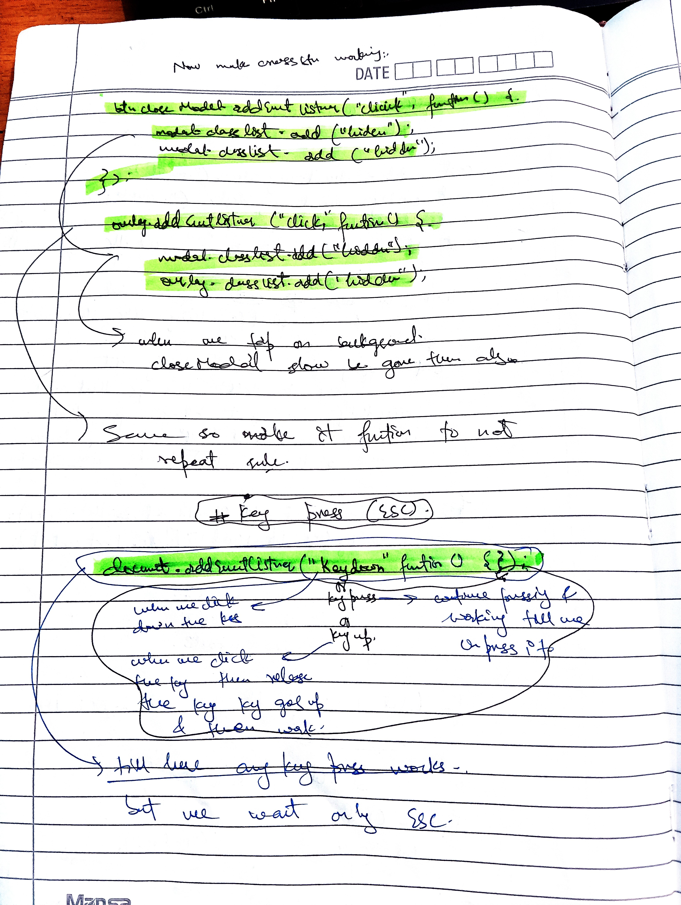

### it is format


### learning-javascript


### class9 - of - chapter1 - [Basic Operators]


### class10 - of - chapter1 - [Operator Precedense]


### class11 to 13 - of - chapter1 - [challenge1]

_i do the challenge in my folder challenges._

### class14 - of - chapter1 - [string and templeate litreals]


### class 15 [challenge2]

_complete the challenge in challenge folder_

### Class16 to 18 - of - chpater1 [taking decisions if else statements & type conversion and type coercion]


### Class19 - of - chapter1 - truthy and falsy statements


### Class20 - of - chapter1 - Equality Operators


### Class21 - of - chapter1 - Boolean Logic & Operators


### Class22 - of - chapter1 - Logical Operators


### Class - 23 & 24 - of - chapter1 - challenge3 completed

_completed in my challenges folder_

### Class25 - of - chapter1 - The Switch Statement


### Class26 - of - chapter1 - Statements and Expressions

**here we just learn the difference between expressiond and statements only thing to remember from that lecture in future classes we have to learn more about this**

### Class27 - of -chapter1 - The Conditional Operator


### Class 28 to 29 - of - chapter1 - challenge4

**i done this in my challenges folder**

### Class 30 - of - chapter1 - Javascript Releases

_only history of js_

\*\*chapter1-complete-here

### Class 1 to 2 - of - chapter2 - Activating Strict Mode

- use strict mode in js file before writting any code eg.
  ` 'use strict';`

### Class3 - of - chapter2 - Functions


[](https://youtube.com/shorts/6FXoRSh_YC8?si=HtvzaTMZpSGD6HAN)
[](https://youtu.be/y3i4Fca-_H4?si=GAZILy-WOmEczzo1)


### Class4 - of - chapter2 - Function Declaration vs Expressions


### Class5 - of - chapter2 - Arrow Functions


```
const clacAge3 = birthYear => 2073 - birthYear;
const age = clacAge3(2007);
console.log(age);


const mobileNameAndWarranty = (buyYear, timeUsed, naam) => {
    const warrantyTime = 2025 - buyYear;
    const warrantyLeft = warrantyTime - timeUsed;
    return `${naam} warranty left only ${warrantyLeft}`;
}
const hi3 = mobileNameAndWarranty(2023, 1, "poco");
console.log(hi3)
```

**look here i write many parameters and also many lines of code here**

### Class6 - of - chapter2 - Functions Calling Other Functions


- or another example is

```
var warrantyMonths = function (inMonths) {
    return inMonths * 12;
}

const mobileNameAndWarranty2 = (buyYear1, timeUsedInYears1, naam1) => {
    const warrantyTime1 = 2025 - buyYear1;
    const warrantyLeft1 = warrantyTime1 - timeUsedInYears1;

    var howMonths = warrantyMonths(warrantyLeft1)


    return `${naam1} warranty left only ${howMonths} months`;
}
const hi32 = mobileNameAndWarranty2(2023, 1.5, "poco m4 pro 5G");
console.log(hi32)
```

## look how calling function from another function works


### Class7 - of - chapter2 - Function Reviewing


- another example is here bro...

```
var warrantyMonths3 = function (inMonths) {
    return inMonths * 12;
}


const mobileNameAndWarranty3 = (buyYear3, timeUsedInYears3, naam3) => {


    const warrantyTime3 = 2025 - buyYear3;
    const warrantyLeft3 = warrantyTime3 - timeUsedInYears3;

    var howMonths3 = warrantyMonths3(warrantyLeft3)
    if (howMonths3 > 0) {
        return `${naam3} warranty left only ${howMonths3} months`;
    }
    else if (buyYear3 !== typeof number && timeUsedInYears3 !== typeof number) {
        return `enter valid data only in maths`
    }
    else if (howMonths3 <= 0) {
        return `${naam3} warranty is already expired`;
    }
}
const hi321 = mobileNameAndWarranty3(prompt(`enter buying year`), prompt(`enter how many years u used it`), prompt(`enter name of ur device`));
console.log(hi321);
```

### Class 8 to 9 - of - chapter2 - Challenge5

_i have done it this challenge in my challenge folder_

### Class10 - of chapter2 - introduction to Array


### Class11 - of - chapter2 - Basic Array Operations


### class12 & 13 - of - chapter2 - Is a Challenge

_done in my challenges folder in challenge6_

### Class14 - of - Chapter2 - Introduction to Objects

 +

### Class15 - of - chapter2 - Dot vs Bracket Notation


**result**


### Class16 - of - Chapter2 - Object Methods


### Class 17 to 18 - of - chapter2 - challenge7

**already done in my challenge folder**

### Class19 - of - chapter2 - Iteration Of For Loop


### Class20 - of - chapter2 - Looping Arrays, Breaking and Continuing


### Class21 - of - chapter2 - LoopingBackwards And Loops In Loops


### Class22 - of - chapter2 - While loop


#### Chapter3 starts

**chapter3 is just the roadmap of this jscourse**

#### Chapter4 starts

**i think this chapter is just about settings of vs code**

### class1-2 - of - chapter4

_are just intros of chapter 4_

### Class3 - of - chapter4 - setting up prettier extension

_also nothing in this video just tells how to set up prettier extension_

### Class4 - of - chapter4 - Installing Node.js and Setting Up a Dev Environment

**in this telling is how to install live server**
_and nothing important_

### Class5 - of - chapter4 - Learning How to Code

**just motivation in this class Class5 to whole chapter- of - chapter4 - Learning How to Code. Just motivation in this chapter, settings, debugging, ai assistance in coding**

### Chapter5

**is just about html and css for those who dont know about html and css but we already know**

### chapter6

### class 1 to 11 - projec1(Guess My Number)

_projec1 html code_

```
<!DOCTYPE html>
<html lang="en">
  <head>
    <meta charset="UTF-8" />
    <meta name="viewport" content="width=device-width, initial-scale=1.0" />
    <title>Document</title>
  </head>
  <body>
    <script src="project1.js"></script>
    <link rel="stylesheet" href="project1.css" />

      <body>
    <header>
      <h1>Guess My Number!</h1>
      <p class="between">(Between 1 and 20)</p>
      <button class="btn again">Again!</button>
      <div class="number">?</div>
    </header>
    <main>
      <section class="left">
        <input type="number" class="guess" />
        <button class="btn check">Check!</button>
      </section>
      <section class="right">
        <p class="message">Start guessing...</p>
        <p class="label-score">💯 Score: <span class="score">20</span></p>
        <p class="label-highscore">
          🥇 Highscore: <span class="highscore">0</span>
        </p>
      </section>
    </main>
  </body>
</html>

```

_project1 css code_

```
@import url("https://fonts.googleapis.com/css?family=Press+Start+2P&display=swap");

* {
  margin: 0;
  padding: 0;
  box-sizing: inherit;
}

html {
  font-size: 62.5%;
  box-sizing: border-box;
}

body {
  font-family: "Press Start 2P", sans-serif;
  color: #eee;
  background-color: #222;
  /* background-color: #60b347; */
}

/* LAYOUT */
header {
  position: relative;
  height: 35vh;
  border-bottom: 7px solid #eee;
}

main {
  height: 65vh;
  color: #eee;
  display: flex;
  align-items: center;
  justify-content: space-around;
}

.left {
  width: 52rem;
  display: flex;
  flex-direction: column;
  align-items: center;
}

.right {
  width: 52rem;
  font-size: 2rem;
}

/* ELEMENTS STYLE */
h1 {
  font-size: 4rem;
  text-align: center;
  position: absolute;
  width: 100%;
  top: 52%;
  left: 50%;
  transform: translate(-50%, -50%);
}

.number {
  background: #eee;
  color: #333;
  font-size: 6rem;
  width: 15rem;
  padding: 3rem 0rem;
  text-align: center;
  position: absolute;
  bottom: 0;
  left: 50%;
  transform: translate(-50%, 50%);
}

.between {
  font-size: 1.4rem;
  position: absolute;
  top: 2rem;
  right: 2rem;
}

.again {
  position: absolute;
  top: 2rem;
  left: 2rem;
}

.guess {
  background: none;
  border: 4px solid #eee;
  font-family: inherit;
  color: inherit;
  font-size: 5rem;
  padding: 2.5rem;
  width: 25rem;
  text-align: center;
  display: block;
  margin-bottom: 3rem;
}

.btn {
  border: none;
  background-color: #eee;
  color: #222;
  font-size: 2rem;
  font-family: inherit;
  padding: 2rem 3rem;
  cursor: pointer;
}

.btn:hover {
  background-color: #ccc;
}

.message {
  margin-bottom: 8rem;
  height: 3rem;
}

.label-score {
  margin-bottom: 2rem;
}

```

_now js_


### class 12 to 14 - projec2(Model Window)

**Html code**

```
<!DOCTYPE html>
<html lang="en">
  <head>
    <meta charset="UTF-8" />
    <meta name="viewport" content="width=device-width, initial-scale=1.0" />
    <title>Document</title>
    <link rel="preconnect" href="https://fonts.googleapis.com" />
    <link rel="preconnect" href="https://fonts.gstatic.com" crossorigin />
    <link
      href="https://fonts.googleapis.com/css2?family=Acme&family=Anek+Telugu:wght@100..800&family=Aoboshi+One&family=Are+You+Serious&family=Astloch:wght@400;700&family=Exo+2:ital,wght@0,100..900;1,100..900&family=Federant&family=Fira+Sans:ital,wght@0,100;0,200;0,300;0,400;0,500;0,600;0,700;0,800;0,900;1,100;1,200;1,300;1,400;1,500;1,600;1,700;1,800;1,900&family=Forum&family=Inconsolata:wght@200..900&family=Roboto:ital,wght@0,100..900;1,100..900&family=Rock+Salt&family=Shadows+Into+Light&family=WDXL+Lubrifont+TC&display=swap"
      rel="stylesheet"
    />
  </head>
  <body>
    <div class="show-case">
      <button class="show-model">Show Model 1</button>
      <button class="show-model">Show Model 2</button>
      <button class="show-model">Show model 3</button>
    </div>
    <div class="hidden">
      <div class="hidden-model-styles">
        <button class="cross-btn">&times;</button>
        <h1>Hey Hi I a'm a Model Window 🥰</h1>
        <p>
          Lorem, ipsum dolor sit amet consectetur adipisicing elit. In, pariatur
          voluptatibus? Ratione voluptate alias ullam possimus atque eius, nam
          eaque similique rem iure a eveniet velit reiciendis, impedit soluta
          vel. Eveniet iste expedita dolorem dolor aliquid incidunt non, fugiat
          quasi ipsam tempora tempore nihil. Asperiores ad explicabo iste
          mollitia laborum doloremque dolores, obcaecati adipisci ea sequi
          voluptatibus. Ex, quo consequatur. Quidem laborum rem, aperiam,
          officiis quae aliquam nam dignissimos incidunt magni voluptate velit
          in nostrum! Modi quis eveniet error, nisi, culpa quas cumque
          praesentium aperiam, ex esse architecto dolorem inventore.
        </p>
      </div>
    </div>
    <div class="overlay hidden"></div>
    <link rel="stylesheet" href="project2.css" />
    <script src="project2.js"></script>
  </body>
</html>

```

**css code**

```
body {
  color: white;
  background: linear-gradient(to right, #0054b4, #40e0d0);
  display: flex;
  flex-direction: column;
  align-items: center;
}
.show-case {
  display: flex;
  flex-direction: row;
  justify-content: space-around;
  width: 100%;
}
.show-model {
  border: none;
  text-decoration: none;
  font-size: 4rem;
  border-radius: 30%;
  padding: 8px 16px; /* 10px top/bottom, 5px left/right */
}
.hidden-model-styles {
  display: flex;
  flex-direction: column;
  background-color: #6617cb;
  background-image: linear-gradient(315deg, #6617cb 0%, #cb218e 74%);
  width: 600px;
  align-items: center;
  justify-content: center;
  margin-top: 50px;
  z-index: 2;
  position: fixed;
  top: 50%;
  left: 50%;
  transform: translate(-50%, -50%);
}
.hidden-model-styles p {
  font-size: 1.6rem;
  padding-left: 5px;
  font-family: Shadows Into Light;
  font-weight: bold;
}
.hidden {
  display: none;
}
.overlay {
  position: absolute;
  top: 0;
  left: 0;
  width: 100%;
  height: 100%;
  background: rgba(0, 0, 0, 0.4); /* dim effect */
  backdrop-filter: blur(5px); /* blur effect */
  z-index: 1;
}

```

**js-code**

```
"use strict;";
const openBtn = document.querySelectorAll(".show-model");
const hiddenDiv = document.querySelector(".hidden");
const overlay = document.querySelector(".overlay");
const addinghidden = function () {
  hiddenDiv.classList.add("hidden");
  overlay.classList.add("hidden");
};
const removeHidden = function () {
  hiddenDiv.classList.remove("hidden");
  overlay.classList.remove("hidden");
};

for (let i = 0; i < openBtn.length; i++) {
  openBtn[i].addEventListener("click", function () {
    removeHidden();
  });
}
const showNow = document.querySelector(".cross-btn");
showNow.addEventListener("click", function () {
  addinghidden();
});
document.addEventListener("keydown", function (hi) {
  if (hi.key === "Escape") {
    if (!hiddenDiv.classList.contains("hidden")) {
      addinghidden();
    }
  }
});

```





_IMPORTANT THINGS LEARNED IN THESE TWO PROJECTS_

Project 1: Guess the Number Game

New things / important points learned:

DOM Manipulation

document.querySelector() → select elements

.textContent → change text

.style → change CSS dynamically

Event Listeners

.addEventListener("click", function(){}) → run JS when a button is clicked

Functions for Reusability

Created helper functions like displaymessage(), displaynumber(), displayscore()

Keeps code clean and avoids repetition

Random Numbers

Math.random() + Math.trunc() → generate secret number

Learned how to set a range (1–30)

Conditional Logic

if, else if, else to handle:

no input

too high / too low

correct guess

game over

Dynamic Styling

Change body color based on win/loss

Change .number width dynamically

Score / Highscore Logic

Keep track of score

Compare score to highscore and update

Resetting the Game

Clicking “Again” button resets all variables and UI elements

Takeaway: Learned how to combine DOM manipulation, events, random numbers, conditional logic, and dynamic styling to create an interactive game.

Project 2: Modal Popup

New things / important points learned:

Multiple Element Selection

document.querySelectorAll() → select multiple buttons

Loop through them with for to add event listeners

Showing / Hiding Elements

.classList.add("hidden") and .classList.remove("hidden") → toggle visibility

Overlay / Focus Logic

Learned why overlay is needed for UX (blocks background, dim effect)

Both modal and overlay always toggle together

Event Handling for Different Actions

Click to open modal

Click × to close modal

Press Escape key to close modal

Clean Code Practices

Use functions (addinghidden / removeHidden) to avoid repeating code

Keeps code DRY (Don’t Repeat Yourself)

Z-Index and CSS Positioning

Learned how to position modal in center with position: fixed + transform: translate(-50%, -50%)

Use z-index to make modal appear above overlay

Takeaway: Learned how to create interactive UI components with show/hide logic, overlay, multiple event triggers, and clean JS + CSS structure.

✅ Suggestion for README format:

You can write it like this:

Project 1 – Guess the Number Game

Features: Random number, input check, score & highscore, dynamic styling

Key JS concepts learned: DOM manipulation, events, functions, conditional logic, random numbers

Project 2 – Modal Popup

Features: Multiple modals, overlay, close via button or Escape key

Key JS concepts learned: DOM selection, class toggle, multiple event listeners, z-index & CSS positioning
